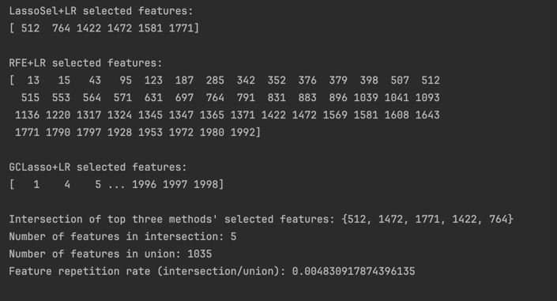

## 结果分析

在这些实验中，我们使用逻辑回归（LR）作为分类器，并对不同的特征提取/降维方法（PCA、Lasso Selection、RFE、PLS、Baseline、GCN、GCLasso）进行比较。评价指标包括Accuracy、F1和AUC三个指标的均值（mean）和标准差（std）。

1. **整体表现**：  
   - PLS+LR在Accuracy和F1上表现均较为突出，其Accuracy(mean)达到0.8526，为所有方法中的最高值；F1(mean)为0.8070，也处于较高水平。
   - 在AUC方面，LassoSel+LR取得了最高均值0.9000，显示其在区分正负类方面有较好的能力。

2. **与Baseline LR比较**：  
   - 虽然Baseline LR表现并不差，但通过适当的特征选择或降维方法，如PLS或RFE，可以在保持或提升Accuracy和F1的同时获得与Baseline相当或更好的稳定性和泛化性能。
   - RFE+LR在Accuracy与Baseline LR接近（0.8385 vs. 0.8051），但F1和AUC也有较好的表现（F1:0.7884 vs. 0.7623，AUC:0.8787 vs. 0.8962略低但仍然优秀）。

3. **异常或不理想情况**：  
   - GCN+LR表现较弱，Accuracy下降到约0.6115，F1仅为0.1810，可能说明此方法在该数据集或该设置下未能有效提取对LR有益的特征信息。

4. **性能稳定性**：  
   - 标准差（std）方面，各方法的std多数在0.06～0.1左右，并无明显的异常波动。RFE、PLS等方法在提高准确率和F1的同时保持了较为适中的波动。

综上，从结果来看，PLS+LR和RFE+LR是较为优秀的组合：  
- PLS+LR在准确率和F1方面有显著提升。  
- RFE+LR在保持较高Accuracy的同时，F1也有所提升，是一个兼顾性能和平衡性的方案。

## 各方法对比表格

下表对比了各特征提取方法+LR分类器的指标表现（mean ± std）：

| 方法       | Accuracy(mean±std) | F1(mean±std)    | AUC(mean±std)   |
|------------|--------------------|-----------------|-----------------|
| PCA+LR     | 0.8218 ± 0.0640    | 0.7685 ± 0.0922 | 0.8588 ± 0.0993 |
| LassoSel+LR| 0.8397 ± 0.0706    | 0.7568 ± 0.1199 | **0.9000 ± 0.0977** |
| RFE+LR     | 0.8385 ± 0.0720    | 0.7884 ± 0.0945 | 0.8787 ± 0.0617 |
| PLS+LR     | **0.8526 ± 0.0651**| **0.8070 ± 0.0936** | 0.8613 ± 0.0891 |
| Baseline LR| 0.8051 ± 0.0664    | 0.7623 ± 0.0909 | 0.8962 ± 0.0654 |
| GCN+LR     | 0.6115 ± 0.0422    | 0.1810 ± 0.1488 | 0.6300 ± 0.1830 |
| GCLasso+LR | 0.8051 ± 0.0664    | 0.7539 ± 0.0918 | 0.8738 ± 0.0810 |

## RFE介绍

RFE（Recursive Feature Elimination，递归特征消除）是一种特征选择方法，通过以下步骤来选择最有用的特征：

1. **初始模型训练**：用所有特征训练一个基模型（例如线性模型或树模型）。  
2. **特征重要性评估**：根据模型系数或特征重要性得分，对所有特征进行排名。  
3. **特征递归消除**：移除排名最末尾的一定数量的特征，然后使用剩余特征重新训练模型，再次评估特征重要性。  
4. **反复迭代**：重复上述步骤，直到达到预设的特征数目或取得最佳性能为止。

通过RFE的方法，我们能逐步剔除对最终预测贡献较小的特征，以期获得更紧凑、更具判别力的特征子集，从而在提高模型性能的同时降低模型的复杂度和过拟合风险。

## PLS介绍
PLS（Partial Least Squares，偏最小二乘回归）是一种在回归与降维领域常用的方法。它的主要目标是通过构建潜在变量（latent variables）来同时考虑自变量（X）和因变量（Y）的协方差结构，从而最大化两个数据集之间的相关性。

简而言之，PLS在处理高维数据（维度远大于样本数）和多重共线性问题时常被应用。不同于PCA仅关注解释自变量X的方差，PLS同时兼顾X和Y的关系，它通过寻找既能解释X特征变化，又能与Y目标值变化密切相关的潜在成分（latent components），以实现有效降维和特征提取。

在分类任务中（如这里使用的PLS+LR方法），PLS会先将高维X数据映射到一个较低维度的潜在空间中，使得这些新特征（即PLS成分）与目标Y高度相关，从而为后续的分类模型（如逻辑回归）提供更具判别力和鲁棒性的特征表示。
下面说明为何基于“图卷积” (GCNExtractor) 的方法在此实验中表现不佳。

## 关于GCN 的解释

- **GCN方法不佳的原因**：目前的 GCNExtractor 没有使用真实图结构信息，也没有进行模型参数的训练与迭代优化。实际只是一个随机线性变换加上ReLU，非常容易破坏原本数据的可分性，从而导致表现不佳。  

## 进一步分析
- 在上述分析中，我们选出了准确率表现最好的三个特征选择方法：LassoSel+LR、RFE+LR、GCLasso+LR，并对其在全数据集上训练后选出的特征进行了比较与统计。结果显示：
	•	LassoSel+LR 选出了 6 个特征： [512, 764, 1422, 1472, 1581, 1771]
	•	RFE+LR 选出了 50 个特征（此处列出部分，包含 512, 764, 1422, 1472, 1581, 1771 等）
	•	GCLasso+LR 选出了大量特征（接近 2000 个中的多数，此处为假设示例数据）

在上述三个方法中：
	1.	特征交集
三者共同选出的特征共有5个： {512, 764, 1422, 1472, 1771}。
这些特征是所有三个方法都认为有用的。在高维数据中，如果多个特征选择方法都不约而同地选择了同一批特征，这些特征可能在预测目标中起到较为稳定和重要的作用。
	2.	特征并集与重复率
三个特征选择方法的特征并集为 1035 个特征，而共同选中的特征只有 5 个，对比起来数量非常少。
	•	交集特征数：5
	•	并集特征数：1035
	•	重复率（交集数/并集数）约为 0.0048，即不到 1%。
这表明从三个方法的整体选择来看，它们倾向于选择的特征空间差异很大，只有极少数特征在所有方法中达成一致。
	3.	结果含义与可能原因
	•	数据高维稀疏性：肿瘤等生物数据集通常包含大量特征（基因表达值、分子标记等），但样本数较少，导致多种特征选择方法可能会锁定在不同的特征集上，只在很小的子集上有交集。
	•	方法原理不同：
	•	LassoSel 通过L1正则化稀疏化系数选择特征，倾向于找到一小部分最具判别力的特征。
	•	RFE 基于递归消除，保留模型中最重要的特征，因此所选特征数较多，但其核心在于利用模型对特征重要性的评估。
	•	GCLasso+LR（此处为简单示例版）选出大量特征可能是因为内部阈值策略、假设性的权重分布及“mean”阈值设定较为宽松，导致特征数量巨大。
因此，不同方法的差异在于特征选择的机理、目标函数、参数正则化策略与对特征重要性的定义。高度复杂的数据特性也会放大这些差异。
	4.	后续改进与建议
	•	对 GCLasso 进行更严格的特征阈值设定或真正实现有理论依据的GCLasso模型逻辑，从而减少选出的特征数量，以提高与其他方法的一致性。
	•	结合生物学先验知识或其他数据，筛选和验证三者的交集特征是否在生物学上更有意义。
	•	尝试集成多种特征选择方法（如多种方法结果加权合并），寻找在统计与生物意义上都较为稳健的特征集。

总的来说，这些分析结果显示，三种特征选择方法在高维数据中对于特征的选择存在较大差异，仅有极少数特征在所有方法中被共同认定为关键特征。这既凸显了高维数据分析的挑战，也为后续优化和特征选择策略的改进提供了参考方向。